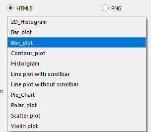

# plotmanager_qgis_plugin

## TABLE OF CONTENTS
Here after you will find all the information you need to getting started with Plotmanage plugin 

	1- Requirements
	2- Install
    3- Create Graph
    4- Customize

## REQUIREMENTS
To work with Plotmanage plugin you will need:

QGIS: Geoprocessing software 
Giswater: QGIS plugin
## INSTALL
Download the project in PATH_OF_YOUR_QGIS_USER\python\plugins
## CREATE GRAPH
### GRAPH TYPE
You can select between HTML5 which will open a tap in your browser with the graph, and PNG will open a new window with the graph.  

### PLOT TYPE
This combo loads the plot types from the selected graph type. 
HTML5:  

### TABLE
Populates the available tables to get the data 

### BASE COLUMN
Select the base column 

### BASE VALUE
Select the base value 

### TARGET COLUMN
Select the target column. This will select the column that you will get the values you want to compare 

### TARGET QUERY FILTER
Here you will put the values you want to get to compare 

### XAXIS
Specifies the column that will be in x axis
 

### YAXIS
Specifies the column that will be in y axis
 

## CUSTOMIZE

### TITLE
#### XAXIS
Selects the title for the xaxis
#### YAXIS
Selects the title for the yaxis
#### TARGET
Selects the title for the target(Only in Plot Type: Line plot with scrollbar)
### MARKER
#### WIDTH
Selects the width from the line. 
Recommended:2
#### TYPE
Specifys wich type of line you want.  
Available: 
['solid', 'dot', 'dash', 'longdash', 'dashdot', 'longdashdot']